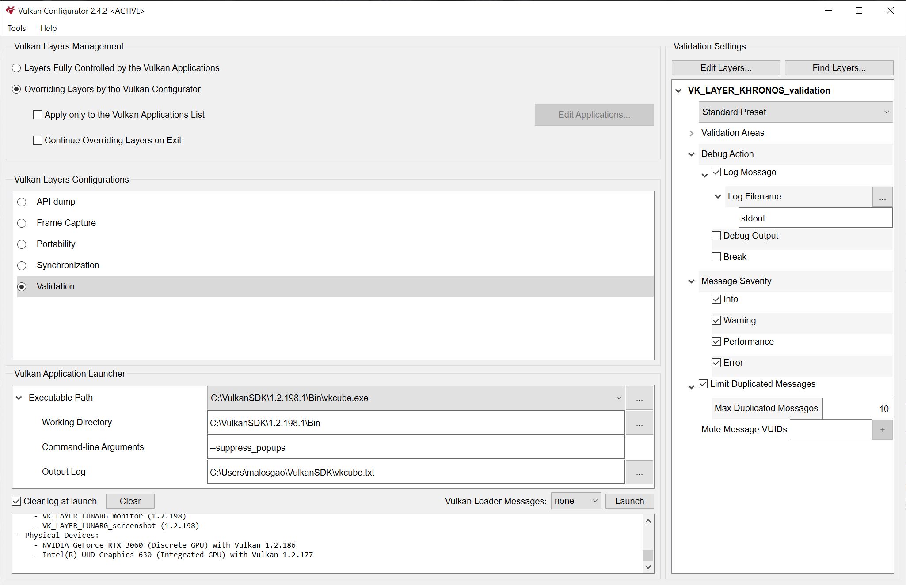

## 验证层 (Validation Layer)

**原文：https://vulkan-tutorial.com/Drawing_a_triangle/Setup/Validation_layers**

流程方法名：`setupDebugCallback()`


### 验证层功能

验证层能帮开发者进行**参数验证（nullptr等）、内存泄漏检测、线程安全检测、日志、Profiling，以及常见逻辑（runtime）错误等**，辅助开发者更好的 debug 不易发现的错误和不规范的 API 调用。

我们可以使用 `vkEnumerateInstanceLayerProperties(...)` 枚举所有可用的验证层。这里使用`VK_LAYER_KHRONOS_validation`（旧版本SDK中称之为：`VK_LAYER_LUNARG_standard_validation`）来进行简单的验证操作。

同时，所有的验证层可以通过 SDK 自带的 Vulkan Configurator 查看并选择，如下图所示：




### 注册验证层回调

可以向验证层注册一个回调函数，方便在程序内处理/打印问题到日志和控制台中。此处我们称之为 `debugCallBack`：

```c++
static VKAPI_ATTR VkBool32 VKAPI_CALL debugCallback(
    
    // Verbose, Info, Warning, Error (by enum values)
    VkDebugUtilsMessageSeverityFlagBitsEXT messageSeverity,
    
    // General, Validation, Performance
    VkDebugUtilsMessageTypeFlagsEXT messageType,
    
    // VkDebugUtilsMessengerCallbackDataEXT { pMessage, pObjects, objectCount }
    const VkDebugUtilsMessengerCallbackDataEXT* pCallbackData,
    
    // User data
    void* pUserData) {

    std::cerr << "validation layer: " << pCallbackData->pMessage << std::endl;

    return VK_FALSE;
}
```

回调使用 `VkDebugUtilsMessengerEXT ` 信使类（此处我们把它声明为一个成员变量，见下方代码）向 `vkCreateDebugUtilsMessengerEXT(instance, "...")`方法注册，该结构体存放上述函数指针，警报筛选器和UserData。

注意：上述方法因为属于extension，所以需要手动加载（使用`vkGetInstanceProcAddr`）：

```c++
auto func = (PFN_vkCreateDebugUtilsMessengerEXT) vkGetInstanceProcAddr(instance, "vkCreateDebugUtilsMessengerEXT");
```

`VkDebugUtilsMessengerEXT` 对象需要使用 `vkDestroyDebugUtilsMessengerEXT` 销毁。该方法同样需要手动加载。

实例加载和销毁的过程中需要用不同的DebugMessenger。将生成出来的`VkDebugUtilsMessengerCreateInfoEXT`放置在`createInfo.pNext`指针中。


### 代码实现

```cpp
// private class member:
VkDebugUtilsMessengerEXT debugMessenger;

void setupDebugMessenger() {
    VkDebugUtilsMessengerCreateInfoEXT createInfo = {};
    
    createInfo.sType = VK_STRUCTURE_TYPE_DEBUG_UTILS_MESSENGER_CREATE_INFO_EXT;
    createInfo.messageSeverity = VK_DEBUG_UTILS_MESSAGE_SEVERITY_WARNING_BIT_EXT | VK_DEBUG_UTILS_MESSAGE_SEVERITY_ERROR_BIT_EXT;
    createInfo.messageType = VK_DEBUG_UTILS_MESSAGE_TYPE_GENERAL_BIT_EXT | VK_DEBUG_UTILS_MESSAGE_TYPE_VALIDATION_BIT_EXT | VK_DEBUG_UTILS_MESSAGE_TYPE_PERFORMANCE_BIT_EXT;
    createInfo.pfnUserCallback = debugCallback; // our callback function!

    if (Util::CreateDebugUtilsMessengerEXT(instance, &createInfo, nullptr, &debugMessenger) != VK_SUCCESS) {
        throw std::runtime_error("failed to set up debug messenger!");
    }
}
```

