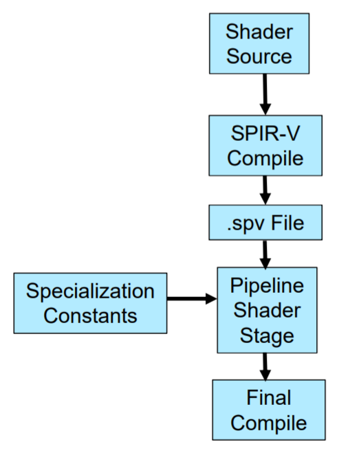

## Specialization Constants

https://github.com/SaschaWillems/Vulkan/blob/master/examples/specializationconstants/specializationconstants.cpp


### 介绍

> Specialization constants are a mechanism whereby constants in a SPIR-V module can have their constant value specified at the time the `VkPipeline` is created. This allows a SPIR-V module to have constants that canbe modified while executing an application that uses the Vulkan API.

先说结论：**使用此方法能够在流水线创建前改变 Shader 中的 Specialization Constants 常量值。该值在流水线创建前可变，创建后在 Shader 中为常量。**如下图所示：



*图出自：https://web.engr.oregonstate.edu/~mjb/vulkan/Handouts/SpecializationConstants.4pp.pdf*

我们常常会遇到在 Shader 中需要根据外部需求，使用宏来打开/关闭某块代码段，或分支执行一块代码段，来构造 “Uber Shader”，即一个多功能的大 Shader，其会根据宏来选择执行的部分。之前，我们可以通过使用宏，并在客户端配合类似于 Include 的机制来实现（glslc 直接支持 `#include`！）。在成熟的大型渲染器和游戏引擎中，其会自带一个 Shader 预处理机制，将里面包含的不同“开关”宏排列组合，生成新的 Shader 变种（Permutation）。但当开关变多时，必然会产生$2^n$组合爆炸，为客户端平添了很多管理成本。

> 还是那个老生常谈的问题：在 GPU 这种数据驱动的高度并行架构中，需要尽量减少分支的个数，或降低分支的逻辑差异（divergence），因此各个引擎才搞出 Shader Permutation 机制，预先枚举所有可能的分支情况。

**而这个 Shader Permutation 机制，其实可以直接交给 Specialization Constant 去做。**该机制实际上就是在每次将 SPIR-V 中间语言结合上流水线状态编译成机器码时，将客户端输入的数据“注入”到 Shader 中，编译出新的最终机器码，因此数据量可能还是会和传统的 Shader Permutation 差不多（这个还是得看各家驱动的实现），**但是客户端开发却省事儿了！**


### 使用

在这个案例中，shader 内部可以根据 `LIGHTING_MODEL` 这个常量来决定使用哪个光照模型，从而避免掉 Shader Permutation，或者在 GPU 中执行分支的操作。Specialization Constant 的声明格式如下：

```GLSL
layout (constant_id = 0) const int LIGHTING_MODEL = 0;
```

于是我们可以在 Shader 逻辑中这么用：

```GLSL
void main() {
	switch (LIGHTING_MODEL) {
		case PHONG:
			// using phong lighting model
		break;
		case TOON:
			// toon shading
		break;
		// ...
	}
}
```

在创建流水线 `vkCreateGraphicsPipelines` 的时候，对于**每一个你想要改变该常量的流水线**，需要首先**对于每一个常量**填写一个 `VkSpecializationMapEntry` 结构体：

```cpp
typedef struct VkSpecializationMapEntry {
    uint32_t    constantID;
    uint32_t    offset;
    size_t      size;
} VkSpecializationMapEntry;
```

里面包含这个常量的值在 Shader 中的 ID，即 `constant_id`，以及 `size` 和 `offset` 。由于我们之后将会使用一个 `void * data` 传递一整个数据，其可以代表多个 Constant 值，因此此处使用 `size` 和 `offset` 来划分当前 Constant 的具体数据位置。

之后使用 `VkSpecializationInfo` 传入上述声明的 struct。

```cpp
typedef struct VkSpecializationInfo {
    uint32_t                           mapEntryCount;  // <- 上述上述声明的 struct 数组大小
    const VkSpecializationMapEntry*    pMapEntries;    // <-                        数据
    size_t                             dataSize;
    const void*                        pData;
} VkSpecializationInfo;
```

在使用 `VkGraphicsPipelineCreateInfo` 创建流水线时，填写 `VkPipelineShaderStageCreateInfo` 的时候，传入上述 `VkSpecializationInfo` 对象即可。

```cpp
typedef struct VkPipelineShaderStageCreateInfo {
    VkStructureType                     sType;
    const void*                         pNext;
    VkPipelineShaderStageCreateFlags    flags;
    VkShaderStageFlagBits               stage;
    VkShaderModule                      module;
    const char*                         pName;
    const VkSpecializationInfo*         pSpecializationInfo; // <-
} VkPipelineShaderStageCreateInfo;
```
