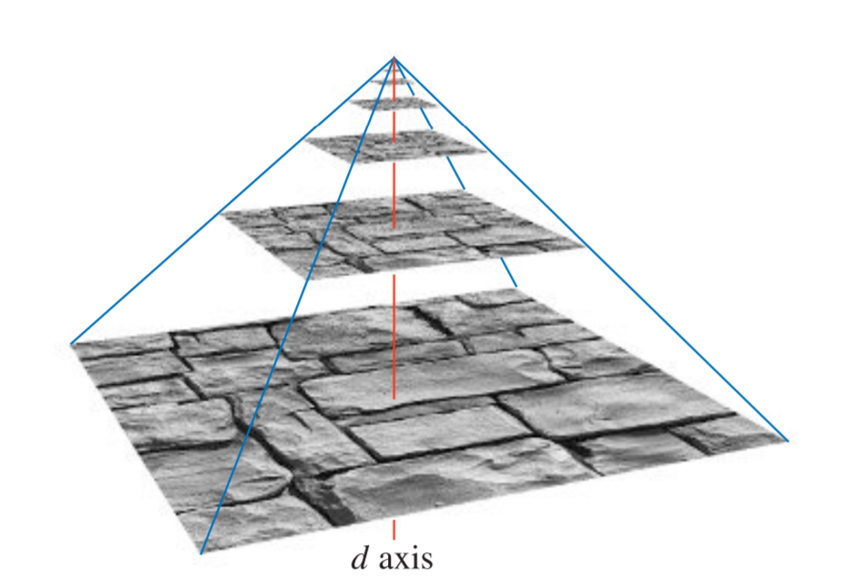

## Mipmapping 

什么是 Mipmap？让我们看一下 [Wikipedia 上的定义](https://zh.wikipedia.org/wiki/Mipmap)：

> 在三维计算机图形的贴图渲染中有一个常用的技术被称为**Mipmapping**。为了加快渲染速度和减少图像锯齿，贴图被处理成由一系列被预先计算和优化过的图片组成的文件,这样的贴图被称为 MIP map 或者 mipmap。这个技术在三维游戏中被非常广泛的使用。“MIP”来自于拉丁语 *multum in parvo* 的首字母，意思是“放置很多东西的小空间”。Mipmap 需要占用一定的内存空间，同时也遵循[小波压缩规则](https://zh.wikipedia.org/w/index.php?title=小波压缩规则&action=edit&redlink=1) （wavelet compression）。

Mipmap，或者 Mipmapping 技术主要为了实现如下功能：

* 如果物体在屏幕上空间占用比较小，我们则不需要使用非常高分辨率的纹理来采样渲染，**提升性能**。
* 根据采样定理，如果原始纹理在屏幕中过小，则可能出现“混叠现象”，即摩尔纹（Moire Pattern），或称为图像锯齿。我们需要使用提前处理好的低分辨率图像代替原始图像进行渲染，来满足采样定理，做到**纹素大小**比上对应到显示器上的**像素大小**尽量为 1:1。

> 采样定理指出，只要离散系统的奈奎斯特频率高于被采样信号的最高频率或[带宽](https://zh.wikipedia.org/wiki/带宽)，就可以避免[混叠](https://zh.wikipedia.org/wiki/混叠)现象。

为了让我们的纹理在屏幕中显示的“干干净净”，这里我们将会对所使用的纹理生成 mipmap 金字塔（见下图，图出自 Real-time Rendering 一书），运行时使用对应层级分辨率的纹理即可。这一系列缩略图的编号可以称为 Mip Level。Level 0 为原图，之后的每一个 Level 都比上一个 level 长宽缩减到一半。

> 由于贴图的长宽一般都是2的幂，所以一种最简单算 mip level 最高能为多少的方法是用 $log_2(max(width, height))$。

同时，为了不让纹理的切换显得突兀，我们可以使用**三线性过滤**和**各向异性过滤**来对不同的 Mip 层级插值过滤得到最终采样结果。之后将会提到。

我们有两种方法来使用 Mipmaps：

* 可以在打包纹理时就将 mipmaps 渲染好存起来，这样运行时可以直接拿来用，但是会占用磁盘空间；
* 在运行时针对原始纹理创建 mipmaps 。这样可以节省硬盘空间，但运行前（或流式加载时的运行时期间）会花费一些时间来动态生成 mipmaps。

该案例介绍后者。

